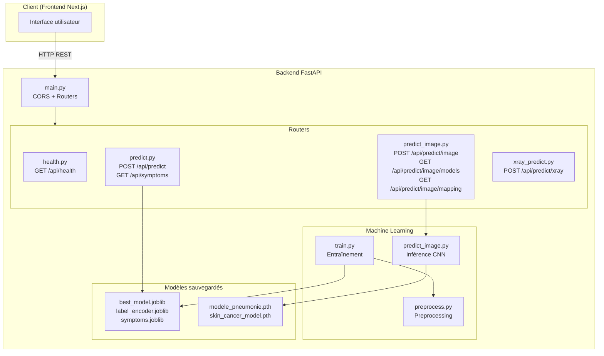
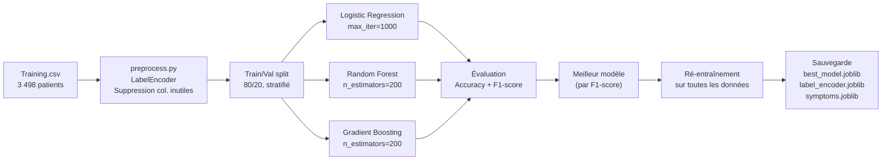
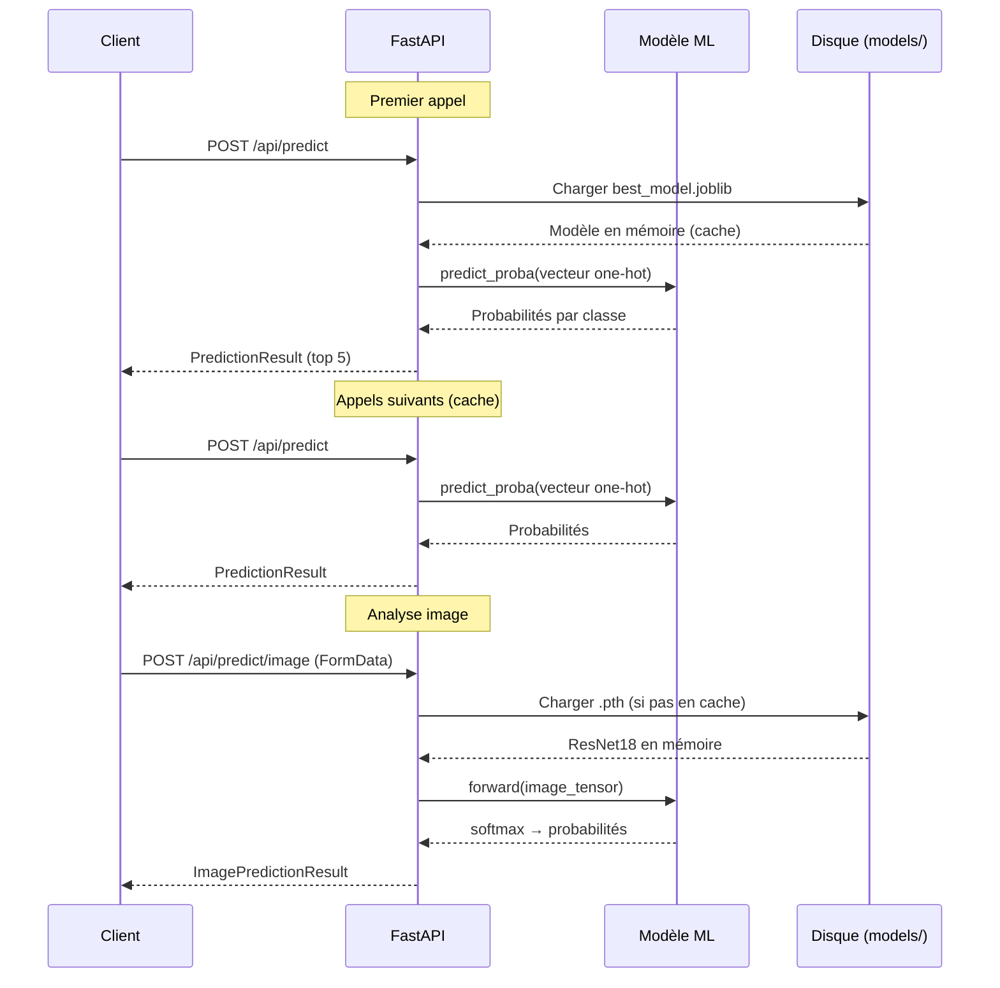

# SYSTEM.md — Backend ChronoPredict

> Documentation technique de l'architecture backend FastAPI.

---

## 1. Vue d'ensemble de l'architecture



### Technologies et versions

| Technologie | Version | Rôle |
|---|---|---|
| FastAPI | 0.115.0 | Framework web async |
| Uvicorn | 0.30.6 | Serveur ASGI |
| Scikit-learn | 1.5.2 | Modèles ML classiques |
| PyTorch | latest | Deep learning (CNN) |
| TorchVision | latest | ResNet18 pré-entraîné |
| Pandas | 2.2.3 | Manipulation de données |
| NumPy | 1.26.4 | Calcul numérique |
| Pydantic | 2.9.2 | Validation de données |
| Pillow | 10.0+ | Traitement d'images |
| python-multipart | 0.0.12 | Upload de fichiers |

### Communication
- **Port** : `8000`
- **CORS** : `allow_origins=["*"]`, `allow_credentials=True`, `allow_methods=["*"]`, `allow_headers=["*"]`
- **Format** : JSON (REST) + multipart/form-data (upload image)

---

## 2. Structure du projet

```
backend/
├── app/
│   ├── main.py                    # Point d'entrée FastAPI, CORS, routers
│   ├── schemas.py                 # Modèles Pydantic (requête/réponse)
│   ├── routers/
│   │   ├── __init__.py
│   │   ├── health.py              # GET /api/health
│   │   ├── predict.py             # POST /api/predict, GET /api/symptoms
│   │   ├── predict_image.py       # Endpoints analyse d'image
│   │   └── xray_predict.py        # POST /api/predict/xray
│   ├── ml/
│   │   ├── __init__.py
│   │   ├── train.py               # Script d'entraînement multi-modèles
│   │   ├── preprocess.py          # Chargement et preprocessing des CSV
│   │   ├── predict_image.py       # Inférence CNN (ResNet18)
│   │   └── train_image.py         # Entraînement des modèles image
│   └── utils/
│       ├── modele.py              # Architectures de modèles
│       ├── data_loader.py         # Chargement de données
│       ├── model_skincancer.py    # Utilitaires cancer de peau
│       ├── model_pneumonia.py     # Utilitaires pneumonie
│       ├── data_loader_skincancer.py
│       ├── prepare_ham10000.py    # Préparation dataset HAM10000
│       └── train_skincancer.py    # Entraînement modèle peau
├── data/
│   ├── Training.csv               # Dataset d'entraînement (~3 498 patients)
│   └── Testing.csv                # Dataset de test
├── models/                        # Modèles sauvegardés (.joblib, .pth)
├── requirements.txt
└── Dockerfile
```

---

## 3. Endpoints API

### `GET /api/health`
**Fichier :** `app/routers/health.py`

Vérification de l'état du serveur.

| Paramètre | Valeur |
|---|---|
| Réponse | `{"status": "ok"}` |
| Code | 200 |

---

### `GET /api/symptoms`
**Fichier :** `app/routers/predict.py`

Retourne la liste de tous les symptômes disponibles.

**Réponse :**
```json
{
  "symptoms": ["itching", "skin_rash", "nodal_skin_eruptions", "..."]
}
```

**Note :** charge le modèle au premier appel (lazy loading).

---

### `POST /api/predict`
**Fichier :** `app/routers/predict.py`

Prédit une maladie à partir d'une liste de symptômes.

**Requête :**
```json
{
  "symptoms": ["headache", "chest_pain", "dizziness", "sweating"]
}
```

**Réponse :**
```json
{
  "prediction": "Hypertension",
  "probabilities": {
    "Hypertension": 0.8234,
    "Heart attack": 0.0567,
    "Migraine": 0.0423,
    "Diabetes": 0.0312,
    "Common Cold": 0.0198
  },
  "risk_level": "High"
}
```

**Logique interne :**
1. Charger le modèle, l'encodeur et la liste de symptômes (`get_model()`)
2. Construire un vecteur one-hot : 1 pour chaque symptôme présent, 0 sinon
3. Appeler `model.predict_proba()` pour obtenir les probabilités
4. Trier et garder le top 5
5. Déterminer le `risk_level` :
   - `>= 0.7` → `"High"`
   - `>= 0.4` → `"Medium"`
   - `< 0.4` → `"Low"`

---

### `POST /api/predict/image`
**Fichier :** `app/routers/predict_image.py`

Analyse une image médicale pour prédire une maladie.

**Requête :** `multipart/form-data`
- `file` : image (JPEG, PNG)
- `model_type` : `"chest_xray"` ou `"skin_lesion"`

**Réponse :**
```json
{
  "prediction": "PNEUMONIA",
  "confidence": 0.9523,
  "probabilities": {
    "NORMAL": 0.0477,
    "PNEUMONIA": 0.9523
  },
  "model_type": "chest_xray",
  "description": "Détection de pneumonie à partir de radiographies thoraciques"
}
```

---

### `GET /api/predict/image/models`
**Fichier :** `app/routers/predict_image.py`

Retourne la liste des modèles image disponibles avec leur statut.

---

### `GET /api/predict/image/mapping`
**Fichier :** `app/routers/predict_image.py`

Retourne le mapping maladie → type de modèle image.

```json
{
  "Pneumonia": "chest_xray",
  "Psoriasis": "skin_lesion",
  "Acne": "skin_lesion",
  "Impetigo": "skin_lesion",
  "Fungal infection": "skin_lesion"
}
```

---

### `POST /api/predict/xray`
**Fichier :** `app/routers/xray_predict.py`

Endpoint dédié à la détection de pneumonie sur radiographie.

**Réponse :**
```json
{
  "nom_fichier": "radio.jpg",
  "diagnostic": "Pneumonie",
  "confiance": "98.50%"
}
```

---

## 4. Schémas Pydantic (`app/schemas.py`)

```python
class SymptomsInput(BaseModel):
    symptoms: list[str]  # min_length=1

class PredictionResult(BaseModel):
    prediction: str
    probabilities: dict[str, float]
    risk_level: str  # "Low" | "Medium" | "High"

class SymptomsListResponse(BaseModel):
    symptoms: list[str]

class XRayPredictionResponse(BaseModel):
    nom_fichier: str
    diagnostic: str   # "Normal" | "Pneumonie"
    confiance: str    # ex: "98.50%"
```

---

## 5. Machine Learning

### Pipeline d'entraînement (symptômes)



**Fichiers :**
- `app/ml/preprocess.py` : charge les CSV, supprime la colonne `Unnamed: 133`, encode les labels
- `app/ml/train.py` : entraîne 3 modèles, compare, sauvegarde le meilleur

### Modèles image (CNN)

**Architecture :** ResNet18 (TorchVision)
- Poids pré-entraînés : aucun (entraîné from scratch sur les données médicales)
- Couche finale : `nn.Linear(512, num_classes)` remplace la couche FC originale
- Toutes les couches sont gelées sauf la couche finale

**Modèle chest_xray :**
- Classes : `["NORMAL", "PNEUMONIA"]`
- Fichier : `models/modele_pneumonie.pth`

**Modèle skin_lesion :**
- Classes : `["akiec", "bcc", "bkl", "df", "mel", "nv", "vasc"]`
- Fichier : `models/skin_cancer_model.pth`
- Dataset : HAM10000 (dermatoscopie)

**Pipeline d'inférence image :**
1. Lire l'image (PIL)
2. Redimensionner à 224×224
3. Normaliser avec les moyennes ImageNet (`[0.485, 0.456, 0.406]`)
4. Passer dans ResNet18 → logits
5. Appliquer softmax → probabilités
6. Retourner la classe avec la probabilité la plus élevée

**Cache :** les modèles sont chargés une seule fois et mis en cache (`_loaded_models`).

---

## 6. Flux de données



---

## 7. Dépendances

| Package | Version | Rôle |
|---|---|---|
| `fastapi` | 0.115.0 | Framework web API |
| `uvicorn` | 0.30.6 | Serveur ASGI |
| `scikit-learn` | 1.5.2 | ML classique (LR, RF, GB) |
| `pandas` | 2.2.3 | Manipulation de DataFrames |
| `numpy` | 1.26.4 | Calcul numérique |
| `joblib` | 1.4.2 | Sérialisation des modèles sklearn |
| `pydantic` | 2.9.2 | Validation des données |
| `python-multipart` | 0.0.12 | Parsing multipart/form-data (upload) |
| `torch` | latest | Framework deep learning |
| `torchvision` | latest | Modèles CNN pré-entraînés |
| `Pillow` | 10.0+ | Lecture et manipulation d'images |

---

## 8. Infrastructure

### Docker Compose

```yaml
services:
  backend:
    build: ./backend
    ports: ["8000:8000"]
    volumes: ["./backend:/app"]
    environment:
      PYTHONUNBUFFERED: "1"
    restart: unless-stopped

  frontend:
    build: ./frontend
    ports: ["3000:3000"]
    environment:
      NEXT_PUBLIC_API_URL: "http://localhost:8000"
    depends_on: [backend]
    restart: unless-stopped
```

### Déploiement
- **Plateforme** : Render
- **Build** : installation des dépendances + `uvicorn app.main:app`
- **Modèles** : doivent être inclus dans le déploiement ou générés au démarrage

### Variables d'environnement
- `PYTHONUNBUFFERED=1` : logs en temps réel
- Pas d'autres variables requises (les chemins sont relatifs)
