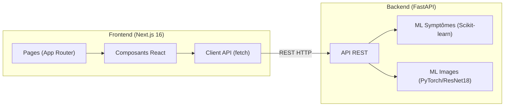
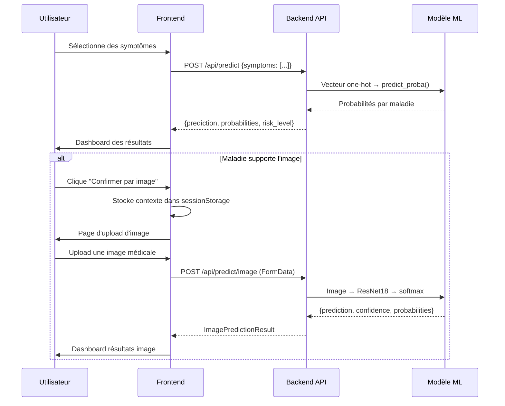

# SYSTEM.md — Frontend ChronoPredict

> Documentation technique du frontend Next.js pour les développeurs.

---

## 1. Vue d'ensemble de l'architecture



### Technologies et versions

| Technologie | Version | Rôle |
|---|---|---|
| Next.js | 16.2.1 | Framework React, App Router, SSR |
| React | 19.2.4 | Bibliothèque UI |
| TypeScript | 5.x | Typage statique |
| Tailwind CSS | 4.x | Framework CSS utility-first |

### Communication entre services
- **Protocole** : REST (HTTP/JSON)
- **Frontend** : port `3000`
- **Backend** : port `8000`
- **CORS** : le backend autorise toutes les origines (`allow_origins=["*"]`)
- **Variable** : `NEXT_PUBLIC_API_URL` configure l'URL du backend

---

## 2. Structure du projet

```
frontend/
├── src/
│   ├── app/                          # Pages (App Router)
│   │   ├── layout.tsx               # Layout racine (Navbar, metadata)
│   │   ├── page.tsx                 # Page d'accueil (hero, features, footer)
│   │   ├── about/page.tsx           # Page À propos
│   │   ├── docs/page.tsx            # Page Documentation
│   │   └── predict/
│   │       ├── page.tsx             # Formulaire de saisie des symptômes
│   │       ├── results/page.tsx     # Dashboard des résultats
│   │       └── image/
│   │           ├── page.tsx         # Upload d'image médicale
│   │           └── results/page.tsx # Résultats de l'analyse image
│   ├── components/                   # Composants réutilisables
│   │   ├── Navbar.tsx               # Barre de navigation sticky
│   │   ├── PredictionForm.tsx       # Sélecteur de symptômes
│   │   ├── ResultsDashboard.tsx     # Affichage des résultats symptômes
│   │   ├── ImageUploadForm.tsx      # Upload drag-and-drop d'images
│   │   └── ImageResultsDashboard.tsx # Résultats analyse image
│   ├── lib/
│   │   └── api.ts                   # Client API (fonctions fetch)
│   └── types/
│       └── index.ts                 # Interfaces TypeScript
├── public/
│   └── docs/                        # Documentation générée (PROCESS, SYSTEM, USER)
├── package.json
├── next.config.ts
├── tsconfig.json
└── postcss.config.mjs
```

---

## 3. Frontend — Détails techniques

### Pages et routing (App Router)

| Route | Fichier | Description |
|---|---|---|
| `/` | `src/app/page.tsx` | Page d'accueil avec hero, features, footer |
| `/predict` | `src/app/predict/page.tsx` | Formulaire de sélection des symptômes |
| `/predict/results` | `src/app/predict/results/page.tsx` | Dashboard des résultats de prédiction |
| `/predict/image` | `src/app/predict/image/page.tsx` | Upload d'image pour confirmation |
| `/predict/image/results` | `src/app/predict/image/results/page.tsx` | Résultats de l'analyse image |
| `/about` | `src/app/about/page.tsx` | Page À propos |
| `/docs` | `src/app/docs/page.tsx` | Page Documentation |

### Composants React

#### `PredictionForm.tsx`
- **Rôle** : Sélecteur interactif de symptômes
- **Props** : `onSubmit: (data: SymptomsInput) => void`, `isLoading: boolean`
- **État** : `selected: Set<string>`, `search: string`
- **Fonctionnalités** :
  - 139 symptômes avec labels français (`SYMPTOM_LABELS`)
  - Recherche en temps réel (filtre par nom français ou anglais)
  - Grille 4 colonnes responsive avec scroll
  - Chips de symptômes sélectionnés avec suppression au clic
  - Bouton de soumission désactivé si aucun symptôme sélectionné

#### `ResultsDashboard.tsx`
- **Rôle** : Affichage du rapport de prédiction
- **Props** : `result: PredictionResult`
- **État** : Aucun état interne (composant de présentation)
- **Fonctionnalités** :
  - Diagnostic principal avec nom traduit en français (`DISEASE_LABELS`, 41+ maladies)
  - Badge de niveau de confiance (Low/Medium/High) avec couleur
  - Top 5 des probabilités avec barres de progression CSS
  - 4 recommandations médicales statiques
  - Bouton "Confirmer par image" conditionnel (via `DISEASE_TO_IMAGE_MODEL`)
  - Bouton "Télécharger PDF" (`window.print()`)
  - Avertissement légal

#### `ImageUploadForm.tsx`
- **Rôle** : Upload d'images médicales par drag-and-drop
- **Fonctionnalités** :
  - Validation de type (image uniquement) et taille (max 10 Mo)
  - Prévisualisation de l'image
  - Zone de drop stylisée

#### `ImageResultsDashboard.tsx`
- **Rôle** : Affichage des résultats d'analyse d'image
- **Fonctionnalités** :
  - Prédiction avec pourcentage de confiance
  - Probabilités par classe du modèle

#### `Navbar.tsx`
- **Rôle** : Navigation principale
- **Fonctionnalités** :
  - Sticky avec effet glass-morphism
  - Liens : Accueil, Analyse, À propos, Documentation
  - Responsive (liens masqués sur mobile)

### Client API (`src/lib/api.ts`)

| Fonction | Méthode | Endpoint | Entrée | Sortie |
|---|---|---|---|---|
| `predictDisease` | POST | `/api/predict` | `SymptomsInput` | `PredictionResult` |
| `fetchSymptoms` | GET | `/api/symptoms` | — | `string[]` |
| `healthCheck` | GET | `/api/health` | — | `boolean` |
| `predictFromImage` | POST | `/api/predict/image` | `File, modelType` | `ImagePredictionResult` |
| `getDiseaseMapping` | GET | `/api/predict/image/mapping` | — | `Record<string, string>` |

- URL de base configurée via `NEXT_PUBLIC_API_URL` (défaut : `http://localhost:8000`)
- `predictFromImage` utilise `FormData` (multipart/form-data)
- Toutes les fonctions lèvent une `Error` avec le `detail` du backend en cas d'échec

### Types TypeScript (`src/types/index.ts`)

```typescript
interface SymptomsInput {
  symptoms: string[];
}

interface PredictionResult {
  prediction: string;           // Nom de la maladie prédite
  probabilities: Record<string, number>; // Top 5 maladies + probabilités
  risk_level: string;           // "Low" | "Medium" | "High"
}

interface ImagePredictionResult {
  prediction: string;           // Classe prédite (ex: "PNEUMONIA")
  confidence: number;           // Confiance (0-1)
  probabilities: Record<string, number>;
  model_type: string;           // "chest_xray" | "skin_lesion"
  description: string;
}

interface ImageModelInfo {
  model_type: string;
  name: string;
  description: string;
  diseases: string[];
  classes: string[];
  is_available: boolean;
}
```

### Gestion d'état
- **Aucun state manager global** (pas de Redux, Zustand, etc.)
- **État local** : `useState` dans chaque composant
- **Passage inter-pages** : `sessionStorage` pour transmettre les résultats de prédiction vers la page de confirmation par image
  - Clés utilisées : `imageConfirmPrediction`, `imageConfirmModelType`, `imageConfirmInstruction`, `imageConfirmLabel`
- **Navigation** : `useRouter()` de Next.js pour les redirections programmatiques

---

## 4. Styles et thème

### Thème médical personnalisé (`globals.css`)
- **Couleur primaire** : `#0284c7` (sky-600)
- **Couleur secondaire** : `#10b981` (emerald-500)
- **Gradient médical** : `medical-gradient` (bleu → vert)
- **Effet glass** : `glass-nav` (backdrop-blur sur la navbar)

### Animations
- `animate-fade-in` : fondu d'entrée sur les pages
- `card-hover` : élévation au survol sur les cartes
- Transitions Tailwind sur les boutons et éléments interactifs

### Responsive
- Grilles adaptatives : 1 colonne (mobile) → 3-4 colonnes (desktop)
- Navigation simplifiée sur mobile
- Conteneurs `max-w-4xl` / `max-w-7xl` centrés

---

## 5. Flux de données



### Mapping maladie → modèle image

| Maladie (symptômes) | Modèle image | Type d'image attendu |
|---|---|---|
| Pneumonia | `chest_xray` | Radiographie thoracique |
| Psoriasis | `skin_lesion` | Photo de lésion cutanée |
| Acne | `skin_lesion` | Photo de la zone affectée |
| Impetigo | `skin_lesion` | Photo de la lésion |
| Fungal infection | `skin_lesion` | Photo de la zone infectée |

---

## 6. Dépendances

### Packages npm principaux

| Package | Version | Rôle |
|---|---|---|
| `next` | 16.2.1 | Framework React full-stack |
| `react` | 19.2.4 | Bibliothèque UI |
| `react-dom` | 19.2.4 | Rendu React dans le DOM |
| `tailwindcss` | 4.x | Framework CSS |
| `typescript` | 5.x | Typage statique |
| `eslint` | 9.x | Linter JavaScript/TypeScript |
| `eslint-config-next` | 16.2.1 | Configuration ESLint pour Next.js |
| `@tailwindcss/postcss` | 4.x | Plugin PostCSS pour Tailwind |

**Note** : aucune bibliothèque de graphiques (Chart.js, Recharts, etc.) n'est utilisée. Les visualisations de probabilités sont des barres CSS Tailwind.

---

## 7. Infrastructure

### Docker
- **Dockerfile** dans `frontend/`
- **Port exposé** : `3000`
- **Variable d'environnement** : `NEXT_PUBLIC_API_URL=http://localhost:8000`
- **Dépendance** : le service `backend` doit démarrer avant le frontend (`depends_on`)

### Déploiement
- **Plateforme** : Vercel
- **Build** : `next build` (automatique sur push)
- **Variable de production** : `NEXT_PUBLIC_API_URL` pointant vers le backend Render
